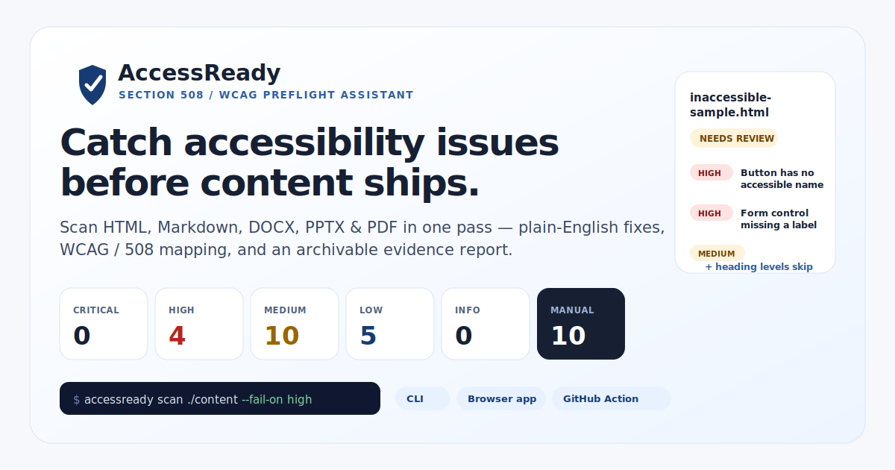
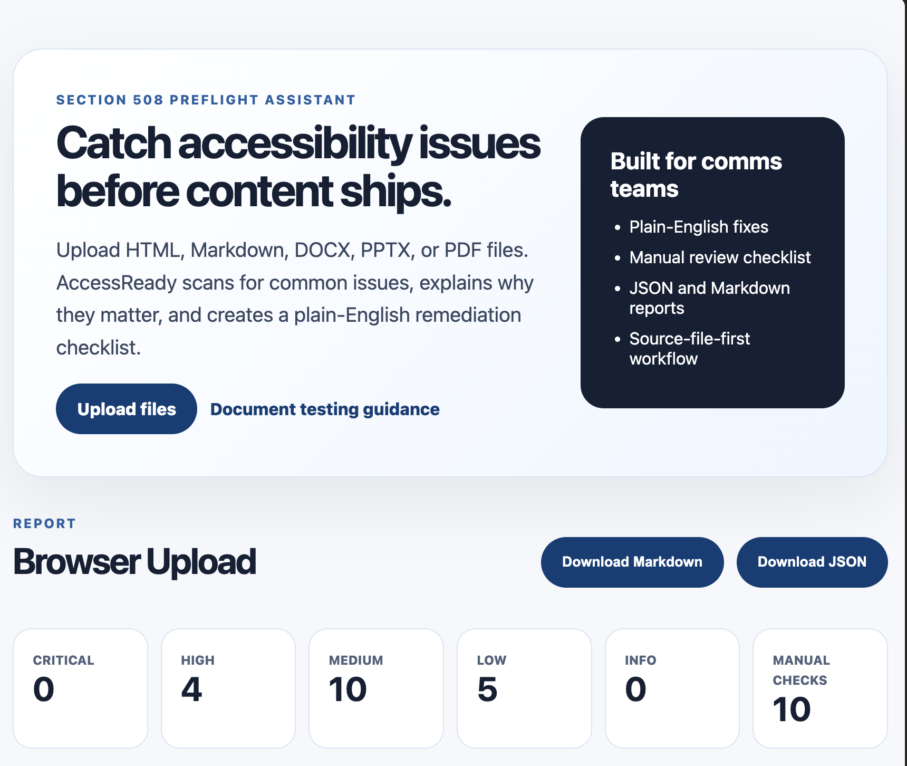
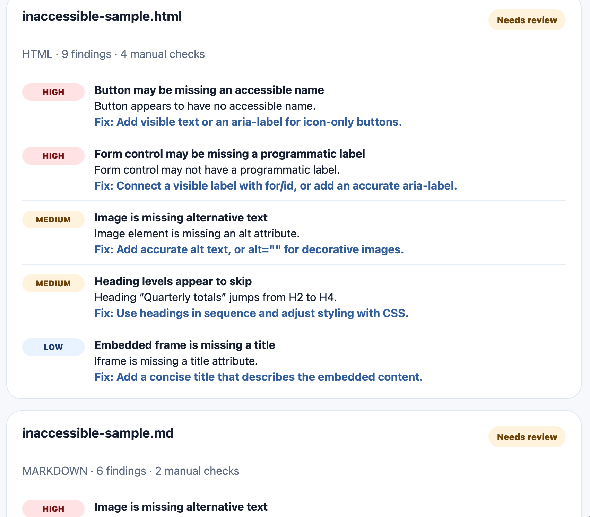

# AccessReady



[](https://github.com/SubchiBeats/accessready/actions/workflows/accessready.yml)
[](LICENSE)
[](https://nodejs.org)

> **Know if your deliverable is AccessReady before you send it.**
> A Section 508 preflight assistant and **Evidence Pack** generator for communications teams shipping government-facing content.

🔗 **[Try the live demo →](https://subchibeats.github.io/accessready/)** — upload files in your browser, no install required.

AccessReady is a Section 508 preflight assistant for communications deliverables. It helps teams identify common accessibility risks, organize remediation, and export review documentation before publishing or sending content to a government-facing client.

> AccessReady supports accessibility review workflows. It does **not** guarantee legal compliance, and does not replace expert audit, PDF remediation, or VPAT/ACR creation. Pair it with manual review before delivery.

## The problem it solves

Communications teams discover 508 issues too late — after the PDF, report, or page is already finalized and approvals are stacking up. Existing tools find issues, but rarely explain fixes in plain English for non-developers, and almost never produce the documentation a client or program officer actually wants: *what was checked, what was fixed, what still needs manual review, and who approved delivery.*

AccessReady focuses on the moment teams actually feel pain: **right before the handoff**.

## Who it's for

- Government contractors submitting deliverables to federal / state / local clients
- Communications teams creating PDFs, reports, newsletters, webinar pages, slide decks, and social copy
- Universities and nonprofits with public-facing content
- Small agencies that can't afford heavy enterprise accessibility platforms
- Freelancers serving public-sector, health, or science clients

## How AccessReady fits alongside Acrobat and Office

Strong accessibility checkers already exist, and AccessReady does **not** try to replace them:

- **Adobe Acrobat Pro** is the right tool for deep PDF/UA tag remediation.
- **Microsoft Word & PowerPoint** have a built-in Accessibility Checker for individual source files.
- **axe, WAVE, and Lighthouse** are excellent for live HTML pages.

What none of those do is take a **whole deliverable** of mixed formats in one pass and hand back a **client-ready evidence package**. That's AccessReady's lane:

| | Acrobat / Office checker | Browser a11y tools | **AccessReady** |
| --- | :---: | :---: | :---: |
| One file at a time | ✅ | ✅ | ✅ |
| HTML + Markdown + DOCX + PPTX + PDF in **one run** | — | — | ✅ |
| Plain-English fix per finding | partial | partial | ✅ |
| **508 Evidence Pack** (methodology, sign-off, remaining risks) | — | — | ✅ |
| Runs automatically in **CI / GitHub Actions** | — | partial | ✅ |

Use AccessReady as the **deliverable gate**: it tells a team what to fix and where across every file in a project, then documents the work for the client — before the deeper single-file tools do final remediation and sign-off.

## What it checks

- Image alt text (HTML, Markdown, DOCX, PPTX)
- Vague link text ("click here," "read more," raw URLs)
- Page / document title and language
- Heading order (skipped levels)
- Tables without detectable headers
- HTML buttons, forms, iframes, and `<video>`/`<audio>` captions
- Simple inline contrast checks
- DOCX/PPTX embedded image descriptions via Office XML
- PDF metadata/tagging preflight (`/StructTreeRoot`, `/Lang`, `/Title`)
- Manual-review flags for reading order, alt-text quality, captions/transcripts, color meaning, and full PDF/UA validation

## What it exports

| Format | What it's for |
| --- | --- |
| `summary` | Quick terminal output for CI |
| `markdown` | Reviewable per-file report |
| `json` | Structured data for dashboards / tooling |
| `csv` | One row per finding with a `status` column — a remediation tracker spreadsheet |
| `pr-comment` | Sticky pull-request comment (idempotent marker, top findings) |
| `evidence-pack` | **Client-ready 508 Evidence Pack** — methodology, files reviewed, findings, manual checks, alt-text register, remediation status, remaining risks, delivery recommendation, reviewer sign-off |

## Preview





The live demo also includes an **interactive sample preflight** (a fake `NIH-webinar-promo-package.zip` with realistic mixed-format issues) and a **508 Evidence Pack** preview you can download.

## Quick start

```bash
npm install
npm run build
npm run scan:samples            # generate a Markdown report
npm run evidence:samples        # generate a 508 Evidence Pack
npm run dev                     # start the browser app
```

## CLI usage

```bash
# Print a terminal summary
accessready scan ./public

# Markdown / JSON / CSV report
accessready scan ./public --format markdown --out report.md
accessready scan ./public --format json     --out report.json
accessready scan ./public --format csv      --out remediation-log.csv

# Client-ready 508 Evidence Pack
accessready scan ./deliverable --format evidence-pack \
  --project-name "NIH webinar promo package" \
  --out AccessReady-evidence-pack.md

# Sticky pull-request comment summary
accessready scan ./public --format pr-comment --out comment.md

# Fail CI on high-severity findings
accessready scan ./content --fail-on high

# Ignore generated/vendor folders
accessready scan ./public --ignore "**/vendor/**" --ignore "**/.next/**"
```

## GitHub Action

Copy [`.github/workflows/accessready.yml`](.github/workflows/accessready.yml) to gate releases, or [`.github/workflows/accessready-pr-comment.yml`](.github/workflows/accessready-pr-comment.yml) to post a self-updating preflight comment on every pull request.

```yaml
name: AccessReady 508 Preflight
on: [pull_request, push]
jobs:
  accessready:
    runs-on: ubuntu-latest
    steps:
      - uses: actions/checkout@v6
      - uses: actions/setup-node@v6
        with: { node-version: 20, cache: npm }
      - run: npm ci
      - run: npm run build
      - run: npm run accessready -- scan ./public ./docs --format evidence-pack --out AccessReady-evidence-pack.md --fail-on high
      - uses: actions/upload-artifact@v7
        if: always()
        with:
          name: accessready-evidence-pack
          path: AccessReady-evidence-pack.md
```

## Sample reports

- [`samples/generated-accessready-report.md`](samples/generated-accessready-report.md) — Markdown report from `npm run scan:samples`
- [`samples/sample-evidence-pack.md`](samples/sample-evidence-pack.md) — full 508 Evidence Pack from `npm run evidence:samples`

## Roadmap

**Now**
- HTML / Markdown scanning
- DOCX / PPTX preflight checks
- PDF metadata / tagging checks
- Markdown / JSON / **CSV** reports
- **508 Evidence Pack** export
- Interactive browser demo with status tracking

**Next**
- Drag-and-drop folder scanning
- Better PDF structure analysis
- Alt text register builder
- Project-level remediation tracker
- ~~GitHub Action PR comments~~ ✅ shipped

**Future**
- Browser extension
- Google Docs / Drive workflow
- Microsoft Office add-in
- AI-assisted alt-text drafts with human approval
- Client portal
- ACR / VPAT evidence support (not a replacement)

## Grounded in real accessibility workflows

- Supports automated, manual, and hybrid review workflows
- Helps document methodology and findings — Section508.gov's [Essential Elements of an Accessibility Test Report](https://www.section508.gov/test/elements-of-an-accessibility-test-report/) emphasizes recording method, tools, defects, and replication detail
- Encourages human review for subjective checks
- Designed around common 508 / WCAG issue patterns
- Does **not** replace expert audit, PDF remediation, VPAT / ACR creation, or legal review

### Reference

- [Section508.gov — Testing Overview](https://www.section508.gov/test/testing-overview/)
- [Section508.gov — Essential Elements of an Accessibility Test Report](https://www.section508.gov/test/elements-of-an-accessibility-test-report/)
- [Section508.gov — ACR overview](https://www.section508.gov/sell/acr/)
- [ADA Title II Web Rule overview](https://www.ada.gov/resources/2024-03-08-web-rule/)

## Contributing

Pull requests welcome. Please:

1. `npm install && npm run build && npm test`
2. Keep the code readable — small files, clear names, no clever metaprogramming
3. Preserve the positioning: AccessReady is a **preflight + evidence** tool, never a "guaranteed compliance" tool

See [`docs/CONTRIBUTING.md`](docs/CONTRIBUTING.md) for more detail.

## License

MIT — see [LICENSE](LICENSE).
